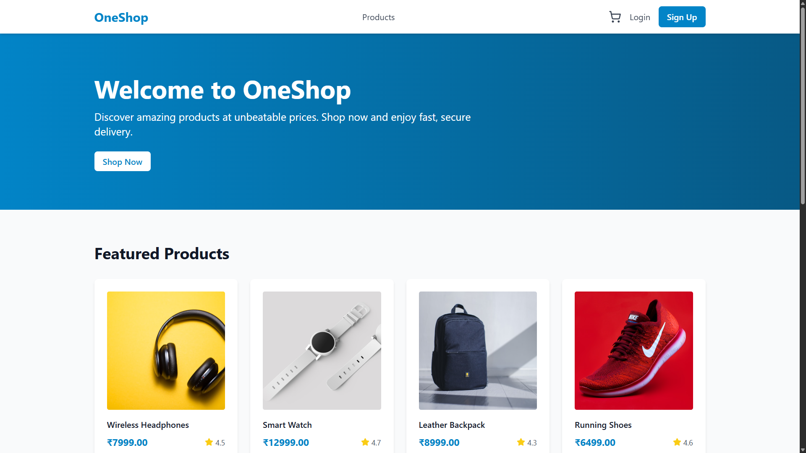

# Rahul Garg - Full Stack Developer Portfolio

A modern, responsive portfolio website showcasing my skills, projects, and experience as a Full Stack Web Developer specializing in the MERN stack.



## 🌟 Features

- **Fully Responsive Design**: Optimized for Desktop (1024px+), Tablet (768px-1023px), and Mobile (<768px)
- **Modern UI/UX**: Clean, professional design with smooth animations and transitions
- **GitHub Integration**: Live GitHub statistics and contribution calendar
- **Project Showcase**: Detailed project cards with live demos and GitHub repositories
- **Skills Display**: Interactive skill cards with technology icons
- **Smooth Navigation**: Fixed navbar with smooth scrolling and mobile hamburger menu
- **SEO Optimized**: Meta tags, semantic HTML, and proper heading structure
- **Accessibility**: ARIA labels, alt text, and keyboard navigation support

## 🚀 Live Demo

**[View Live Portfolio](https://rahulgarg111.github.io/portfolio)**

## 🛠️ Built With

- **HTML5** - Semantic markup
- **CSS3** - Modern styling with CSS Variables, Flexbox, and Grid
- **JavaScript** - Interactive functionality and DOM manipulation
- **Font Awesome** - Icon library
- **Google Fonts** - Poppins and Inter font families
- **GitHub Stats API** - Real-time GitHub statistics
- **GitHub Calendar** - Contribution calendar visualization

## 📋 Sections

1. **Navigation Bar** - Fixed/sticky navigation with smooth scroll
2. **Home/Hero Section** - Introduction with profile image and social links
3. **About Me** - Detailed background, education, and career status
4. **Skills & Tools** - Technical skills and development tools with icons
5. **Projects** - Portfolio of best projects with descriptions and tech stacks
6. **GitHub Statistics** - Live GitHub stats, streaks, and contribution calendar
7. **Contact** - Contact information and social media links
8. **Footer** - Quick links and copyright information

## 📁 Project Structure

```
portfolio/
├── index.html              # Main HTML file
├── README.md              # Project documentation (this file)
├── claude.md              # Development instructions
├── details.md             # Personal information reference
├── assets/
│   ├── images/
│   │   ├── profile/
│   │   │   └── rahul-garg-profile.jpg
│   │   ├── projects/
│   │   │   ├── Project1_cover_image.png
│   │   │   └── Project2_cover_image.png
│   │   └── skills/
│   ├── resume/
│   │   └── Rahul-Garg-Resume.pdf
│   └── favicon/
│       ├── favicon.ico
│       └── favicon.jpg
├── css/
│   └── styles.css         # All CSS styles
└── js/
    └── script.js          # All JavaScript functionality
```

## 🎨 Color Scheme

- **Primary Color**: `#007bff` (Professional Blue)
- **Secondary Color**: `#6c757d` (Dark Gray)
- **Accent Color**: `#28a745` (Green)
- **Background**: `#f8f9fa` (Light Gray)
- **Text**: `#212529` (Dark)

## 📱 Responsive Breakpoints

- **Desktop**: 1024px and above
- **Tablet**: 768px - 1023px
- **Mobile**: Below 768px

## 🚀 Deployment Instructions

### Deploy to GitHub Pages

1. **Create a GitHub Repository**
   ```bash
   # Option 1: For personal site (username.github.io)
   # Create a repository named: username.github.io

   # Option 2: For project site
   # Create a repository with any name (e.g., portfolio)
   ```

2. **Initialize Git and Push Code**
   ```bash
   # Navigate to your portfolio folder
   cd "Portfolio website"

   # Initialize git repository
   git init

   # Add all files
   git add .

   # Commit changes
   git commit -m "Initial commit: Portfolio website"

   # Add remote repository (replace USERNAME and REPO_NAME)
   git remote add origin https://github.com/USERNAME/REPO_NAME.git

   # Push to GitHub
   git branch -M main
   git push -u origin main
   ```

3. **Enable GitHub Pages**
   - Go to your repository on GitHub
   - Click on **Settings** tab
   - Scroll down to **Pages** section (left sidebar)
   - Under **Source**, select **main** branch
   - Click **Save**
   - Your site will be published at:
     - Personal site: `https://username.github.io`
     - Project site: `https://username.github.io/repository-name`

4. **Wait for Deployment**
   - GitHub Pages typically takes 1-5 minutes to deploy
   - You'll see a green checkmark when deployment is successful
   - Visit your live URL to view the portfolio

### Alternative Deployment Options

#### Netlify
1. Drag and drop your portfolio folder to [Netlify Drop](https://app.netlify.com/drop)
2. Or connect your GitHub repository for automatic deployments

#### Vercel
1. Install Vercel CLI: `npm i -g vercel`
2. Run: `vercel` in your portfolio directory
3. Follow the prompts

## 📝 Setup Instructions

### Prerequisites
- A modern web browser (Chrome, Firefox, Safari, or Edge)
- Text editor (VS Code recommended)
- Git installed on your system
- GitHub account

### Local Development

1. **Clone or Download the Repository**
   ```bash
   git clone https://github.com/rahulgarg111/portfolio.git
   cd portfolio
   ```

2. **Open in Browser**
   - Simply open `index.html` in your web browser
   - Or use a local server:
     ```bash
     # Using Python
     python -m http.server 8000

     # Using Node.js (http-server)
     npx http-server

     # Using VS Code Live Server extension
     # Right-click on index.html and select "Open with Live Server"
     ```

3. **View in Browser**
   - Navigate to `http://localhost:8000` (or the port shown)

## 🔧 Customization

### Update Personal Information
Edit the content directly in `index.html` or reference `details.md` for data structure.

### Change Colors
Modify CSS variables in `css/styles.css`:
```css
:root {
    --primary-color: #007bff;
    --secondary-color: #6c757d;
    --accent-color: #28a745;
    /* ... */
}
```

### Add New Projects
Add a new project card in the Projects section of `index.html` following the existing structure.

### Update GitHub Username
In `js/script.js`, change the GitHub username:
```javascript
GitHubCalendar(".calendar", "YOUR_GITHUB_USERNAME", {
    responsive: true,
    tooltips: true
});
```

And update the GitHub stats URLs in `index.html`:
```html

```

## ✅ Pre-Deployment Checklist

- [ ] All personal information updated
- [ ] Resume PDF uploaded to `assets/resume/` folder
- [ ] Resume filename: `Firstname-Lastname-Resume.pdf`
- [ ] All project links working (GitHub and Live demos)
- [ ] All images optimized (<500KB each)
- [ ] Favicon created and linked
- [ ] All external links open in new tabs
- [ ] GitHub username updated in statistics section
- [ ] Tested on Desktop, Tablet, and Mobile
- [ ] Cross-browser tested (Chrome, Firefox, Safari, Edge)
- [ ] No spelling or grammar errors
- [ ] SEO meta tags updated

## 📊 GitHub Statistics Integration

This portfolio uses the following libraries:

1. **GitHub Readme Stats** - [anuraghazra/github-readme-stats](https://github.com/anuraghazra/github-readme-stats)
   - Displays GitHub statistics card
   - Shows top languages
   - Configurable themes

2. **GitHub Calendar** - [Bloggify/github-calendar](https://github.com/Bloggify/github-calendar)
   - Interactive contribution calendar
   - Responsive design
   - Tooltip support

## 🌐 Browser Support

- Chrome (latest)
- Firefox (latest)
- Safari (latest)
- Edge (latest)
- Opera (latest)
- Mobile browsers (iOS Safari, Chrome Mobile)

## 📄 License

This project is open source and available under the [MIT License](LICENSE).

## 👤 Contact

**Rahul Garg**

- Email: [rahul.garg4489@gmail.com](mailto:rahul.garg4489@gmail.com)
- LinkedIn: [linkedin.com/in/rahul-garg-dev](https://www.linkedin.com/in/rahul-garg-dev/)
- GitHub: [github.com/rahulgarg111](https://github.com/rahulgarg111)
- Portfolio: [Your deployed portfolio URL]

## 🙏 Acknowledgments

- Font Awesome for icons
- Google Fonts for typography
- GitHub for stats APIs
- Devicon for technology icons
- Unsplash for placeholder images (if used)

## 📝 Notes

### Important Files to Update Before Deployment

1. **Resume File**: Add your resume PDF to `assets/resume/Rahul-Garg-Resume.pdf`
2. **Favicon**: The current favicon is a renamed JPG. For better compatibility, convert `assets/favicon/favicon.jpg` to proper ICO format using:
   - [Favicon.io](https://favicon.io/)
   - [RealFaviconGenerator](https://realfavicongenerator.net/)
   - [ConvertICO](https://convertico.com/)

3. **Google Drive Resume Link** (Optional backup):
   - Upload resume to Google Drive
   - Set sharing to "Anyone with the link can view"
   - Add link as alternative download option

### Performance Tips

- Optimize images before uploading (use WebP format when possible)
- Enable GitHub Pages CDN for faster loading
- Minimize CSS and JavaScript files for production
- Use lazy loading for images below the fold

### Maintenance

- Update projects section regularly with new work
- Keep skills section current with new technologies learned
- Update GitHub stats links if username changes
- Refresh resume file periodically

---

**Built with ❤️ using HTML, CSS, and JavaScript**

*Last Updated: January 2025*
